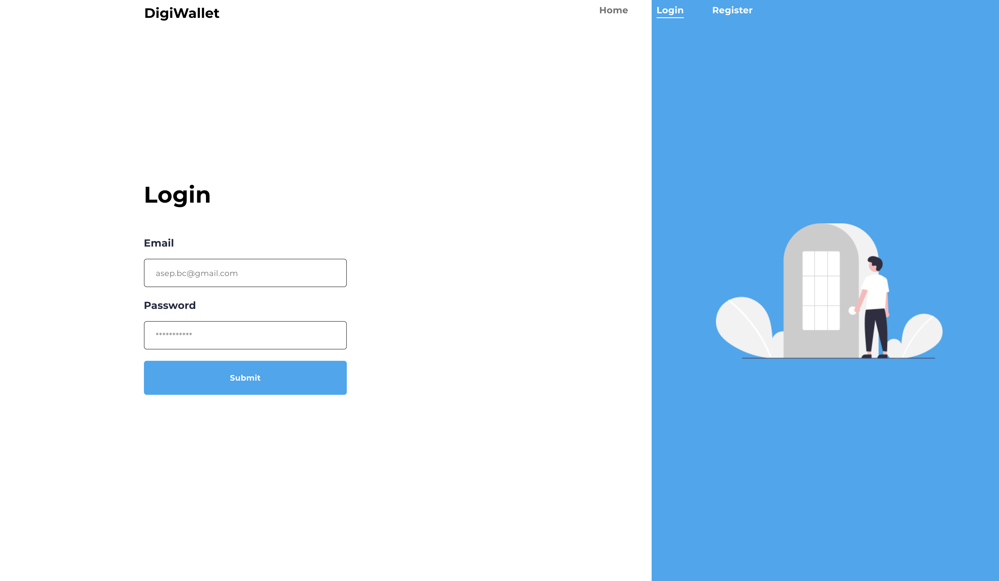
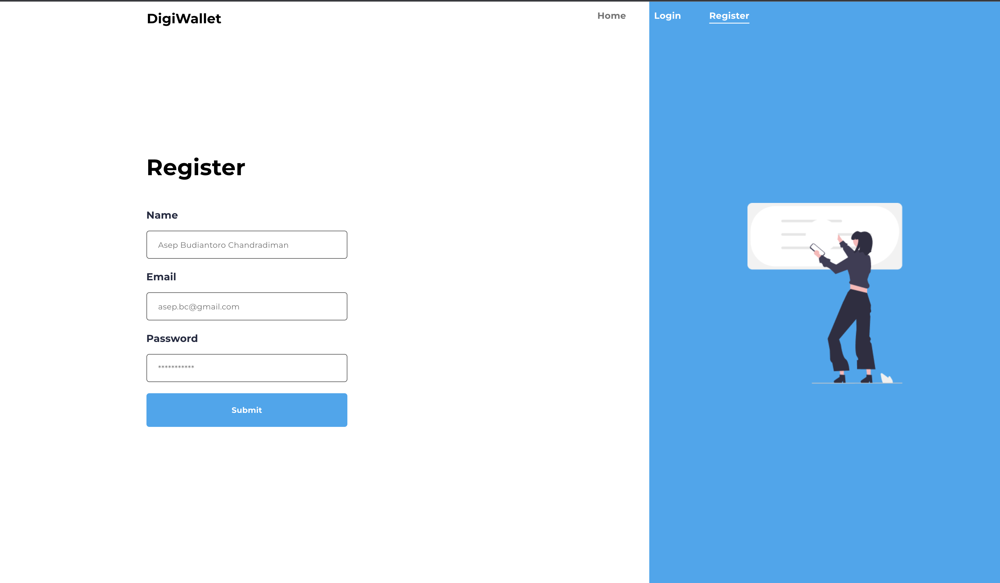
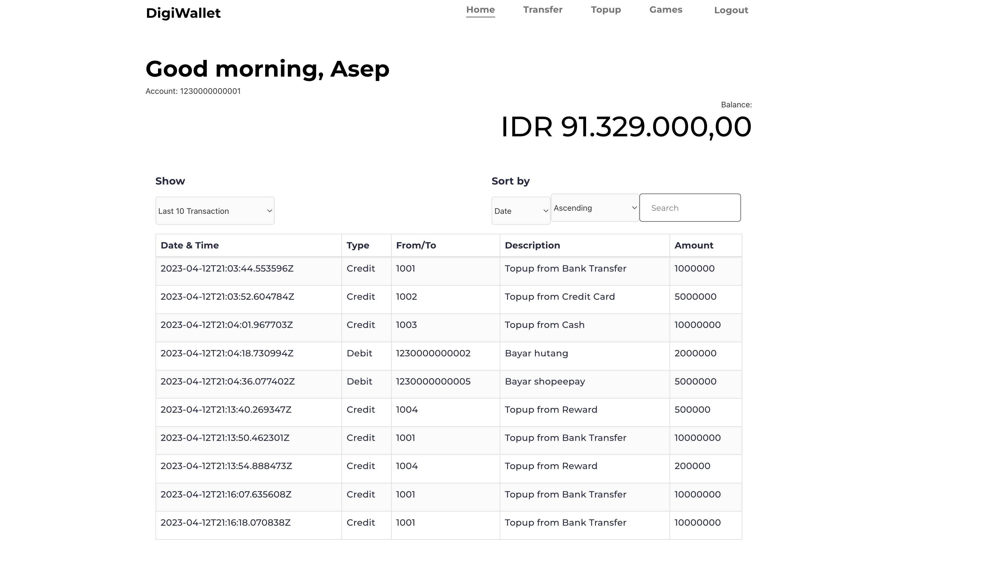
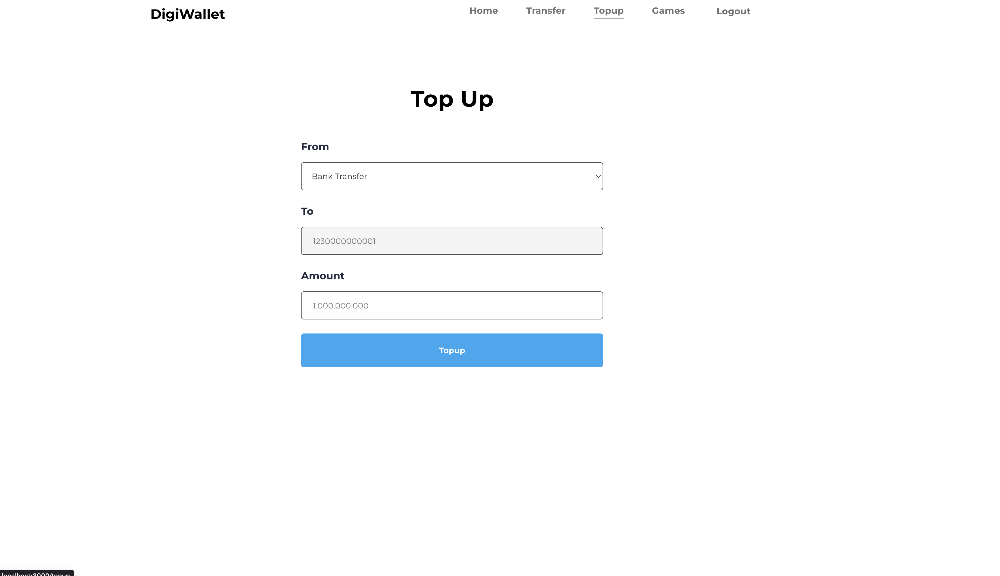
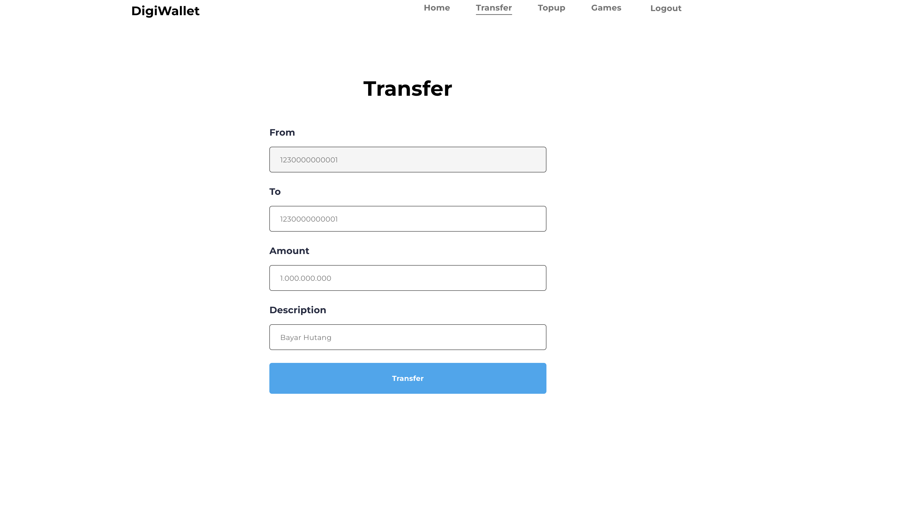
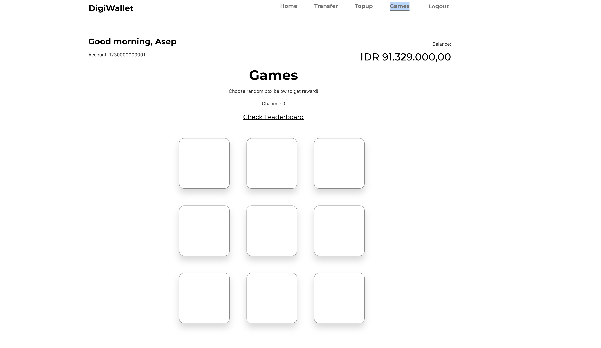
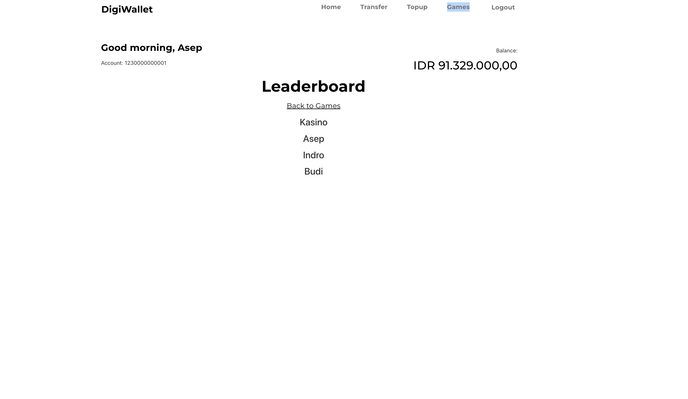

# Project Description

DigiWallet utilizes the power of React with TypeScript, bringing a dynamic and robust frontend experience. Seamlessly integrated with Router, CookiesJS, Axios, and more.

# How to setup project

- run postgreesql database with gin server with the env setting provided from backend directory.
- npm install to install all the dependancy
- npm start to start react on localhost:3000 in dev version
- or npm build & serve -s build to run in build version

# Screenshoots

## Login

## Register

## Home

## Topup

## Transfer

## Games

## Leaderboard

