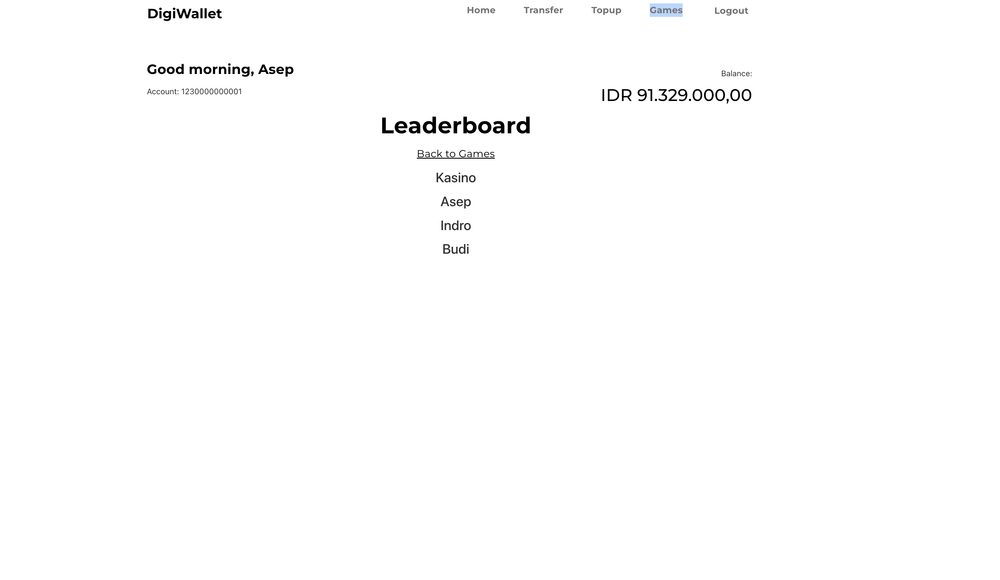

# Project Description

This is an Ewallet web where user can create a new wallet and topup & transfer to other e wallet.

# How to setup project

First, you must run postgreesql database with gin server with the env setting provided. Then you can do npm start to start react on localhost:3000

# Screenshoots

## Login

## Register

## Home

## Topup

## Transfer

## Games

## Leaderboard

